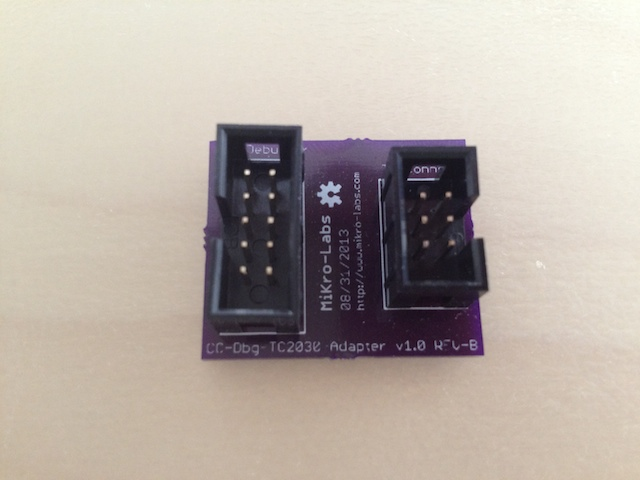
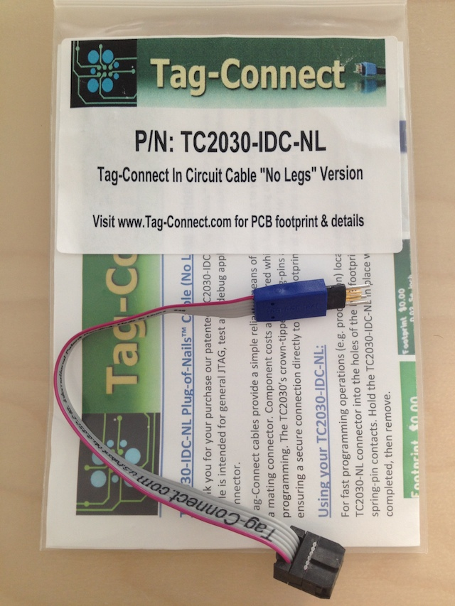
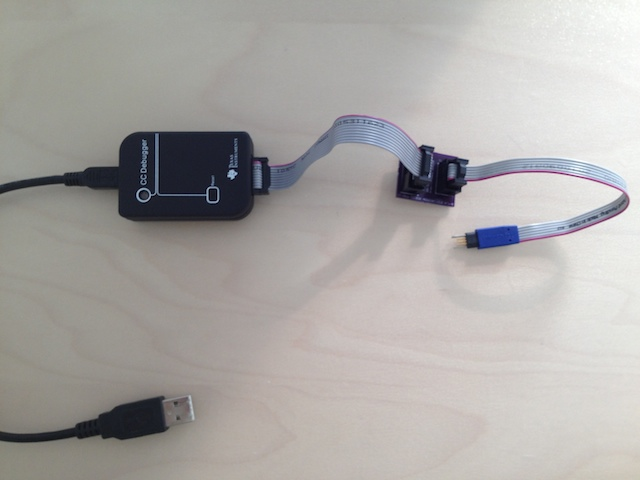

CC-Debugger TC2030 Adapter
===

The CC-Debugger TC2030 Adapter was created in order to reduce the space and cost to program the firmware of my BLEbee. The header I was using on the BLE-Shield was too big to be used on the BLEbee, but an additional cable and the adapter is necessary.

In order to bulid the module, order the PCB at http://www.oshpark.com (http://www.oshpark.com/shared_projects/Ff2LiKQA) and add some headers to the board
 
Photos
===

